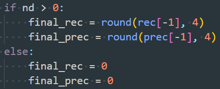
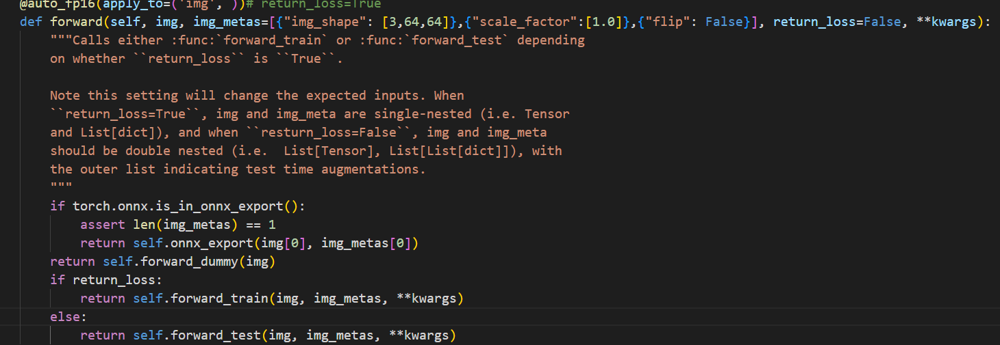
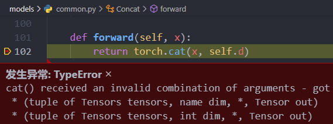
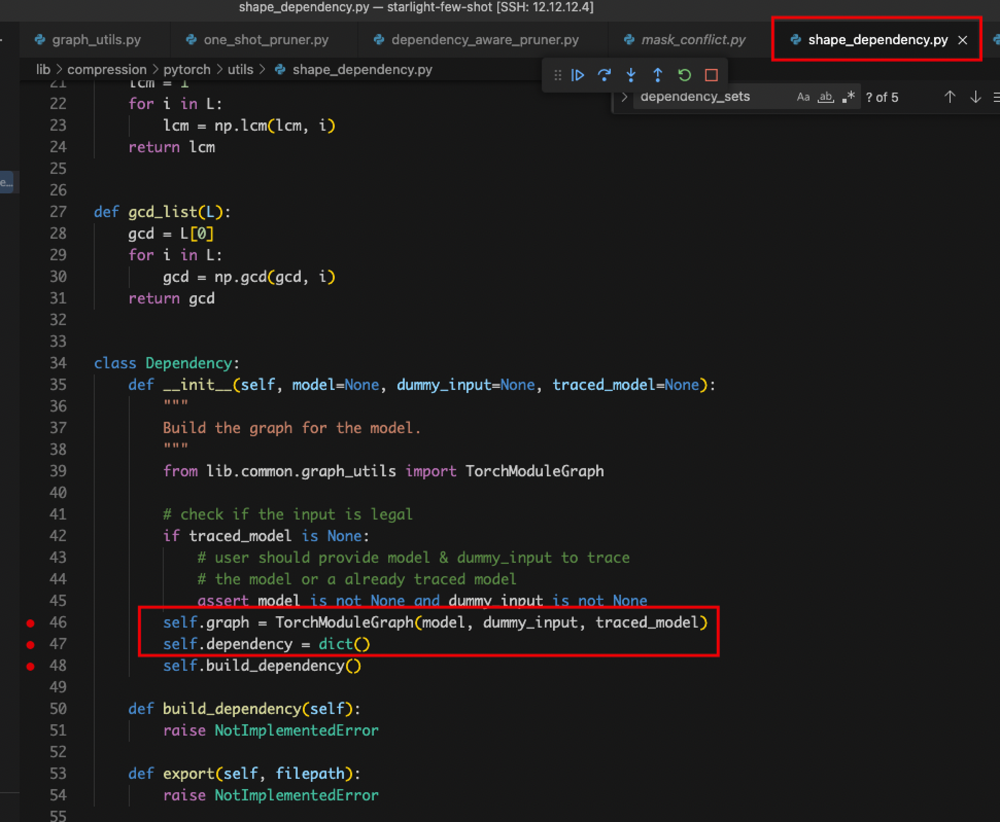
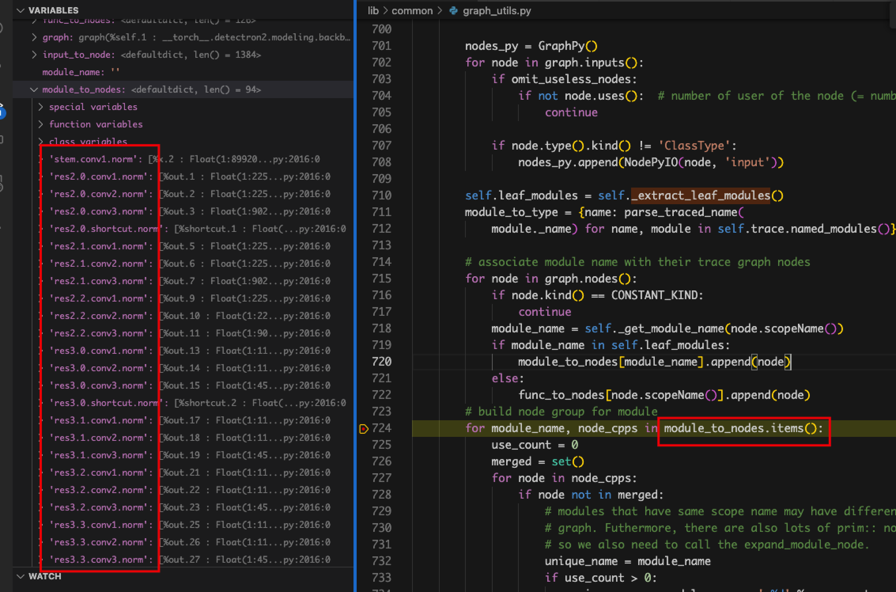
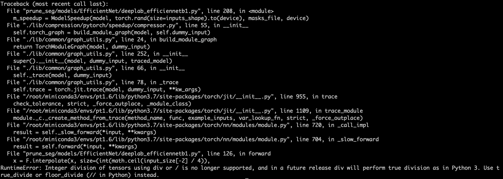
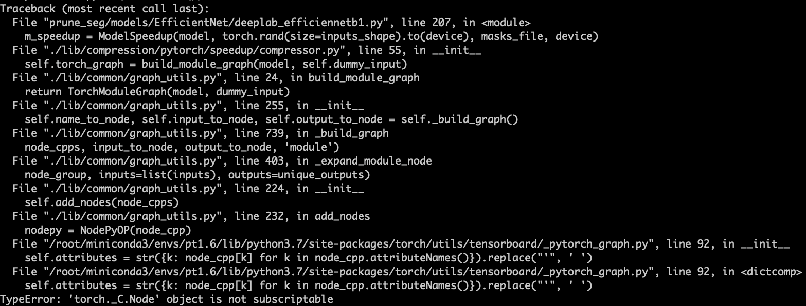
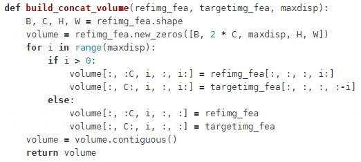
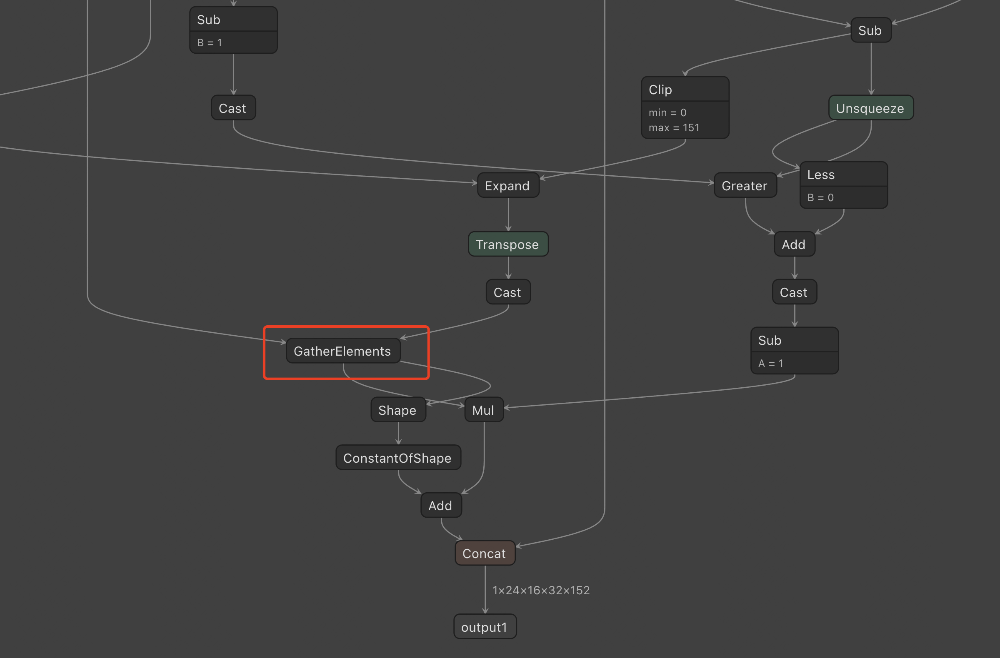
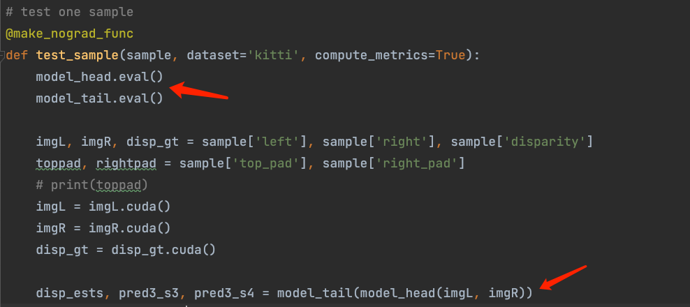

# Bug Summary in Chinese
{: .no_toc }

## Table of contents
{: .no_toc .text-delta }

1. TOC
{:toc}

---

## ResNet50-SSD (Object Detection)

### 剪枝问题记录

1. 使用FPGM方法时，torch.jit.trace无法追踪模型
* 原因：模型有三个输出，如下。其中第三个输出self.priors为常量，与输入无关，导致上述问题

* 解决：重写一个SSD模型文件，仅需改变两点。（1）将输出self.priors从SSD的forward函数中移出（2）在计算loss间，将self.priors放入output中
 

2. 导出剪枝模型后，推理时报错
```python
shape '[32, -1, 4]' is invalid for input of size 915904
File "/home/yanglongxing/project/Compress_ResNet50_Detection/prune_model.py", line 172, in forward (Current frame)    
    output = (arm_loc.view(arm_loc.size(0), -1, 4),
File "/home/yanglongxing/anaconda3/envs/py36-torch1.6-trt7/lib/python3.6/site-packages/torch/nn/modules/module.py", line 722, in _call_impl    
    result = self.forward(*input, **kwargs)  
File "/home/yanglongxing/project/Compress_ResNet50_Detection/prune.py", line 135, in eval_net    
    output = net(x)  
File "/home/yanglongxing/project/Compress_ResNet50_Detection/prune.py", line 317, in main    
    eval_net(val_dataset, val_loader, net, detector, cfg, ValTransform, top_k, thresh=thresh, batch_size=batch_size)  
File "/home/yanglongxing/project/Compress_ResNet50_Detection/prune.py", line 324, in <module>    
    main()  
File "/home/yanglongxing/anaconda3/envs/py36-torch1.6-trt7/lib/python3.6/runpy.py", line 85, in _run_code    
    exec(code, run_globals)  
File "/home/yanglongxing/anaconda3/envs/py36-torch1.6-trt7/lib/python3.6/runpy.py", line 96, in _run_module_code    
    mod_name, mod_spec, pkg_name, script_name)  
File "/home/yanglongxing/anaconda3/envs/py36-torch1.6-trt7/lib/python3.6/runpy.py", line 263, in run_path    
    pkg_name=pkg_name, script_name=fname)  
File "/home/yanglongxing/anaconda3/envs/py36-torch1.6-trt7/lib/python3.6/runpy.py", line 85, in _run_code    
    exec(code, run_globals)  
File "/home/yanglongxing/anaconda3/envs/py36-torch1.6-trt7/lib/python3.6/runpy.py", line 193, in _run_module_as_main    
    "__main__", mod_spec)
```
* 原因：模型输出的loc和cls是通过卷积得到的，而剪枝会剪掉这些输出层的卷积，导致输出尺寸变小，从而报错
* 解决：添加op_names,仅剪枝非输出层的卷积

3. nms在服务器上时间过慢

* 原因：nms是在cpu运行的，而服务器上有太多程序在跑，导致cpu负载过大 
* 解决：在gpu上使用nms

**补充**：**不建议使用gpu的nms**，因为会导致代码在forward的时候出错，包括https://www.cnblogs.com/naive-LR/p/14256624.html和https://blog.csdn.net/m0_38007695/article/details/107065617，后者的解决方案无效。

4. 模型剪枝后微调前推理会报如下错误：
```python
Traceback (most recent call last):
  File "prune.py", line 409, in <module>
    main()
  File "prune.py", line 378, in main
    eval_net(val_dataset, val_loader, net, detector, cfg, ValTransform, os.path.join(args.save_folder, 'after_prune'), top_k, thresh=thresh, batch_size=batch_size)
  File "prune.py", line 175, in eval_net
    val_dataset.evaluate_detections(all_boxes, eval_save_folder)
  File "/home/yanglongxing/project/Compress_ResNet50_Detection/SSD_Pytorch/data/voc0712.py", line 224, in evaluate_detections
    self._do_python_eval(output_dir)
  File "/home/yanglongxing/project/Compress_ResNet50_Detection/SSD_Pytorch/data/voc0712.py", line 280, in _do_python_eval
    use_07_metric=use_07_metric)
  File "/home/yanglongxing/project/Compress_ResNet50_Detection/SSD_Pytorch/data/voc_eval.py", line 158, in voc_eval
    BB = BB[sorted_ind, :]
IndexError: too many indices for array: array is 1-dimensional, but 2 were indexed
```
* 原因：剪枝后微调前精度很差，模型检测不出物体，bounding box为空，此时BB = BB[sorted_ind, :]中的sorted_ind为空list，导致出错
* 解决：在SSD_Pytorch/data/voc_eval.py中修改两处（约143行和193行），修改如下
 

5. 模型剪枝后精度很难恢复 
* 原因：模型微调前，使用剪枝前的optimizer，导致优化参数是剪枝前的参数，而非导出剪枝模型后的参数，所以微调效果有限
* 解决：微调前重新定义optimizer


### 量化问题记录

1. lib包中的ModelSpeedupTensorRT的inference仅支持单输出，而检测模型是二输出
* 解决：新建一个quan_model.py，重写SSD模型，修改内容为添加一个inference函数，作用是调用量化的trt模型得到双输出结果。修改如下：
* SSD模型添加load_engine函数

* SSD模型添加inference(self, x)，注意：由于要torch转onnx，所以要参考剪枝问题1设计模型
```python
def inference(self, x):
        """
        Do inference by tensorrt builded engine.

        Parameters
        ----------
        x : pytorch tensor
            Model input tensor
        """
        # convert pytorch tensor to numpy darray
        self.batchssize = 1
        if x.device != torch.device("cpu"):
            x = x.to("cpu")
        x = np.ascontiguousarray(x.numpy())
        # Numpy dtype should be float32
        assert x.dtype == np.float32
        elapsed_time = 0
        inputs, outputs, bindings, stream = common.allocate_buffers(self.engine.context.engine)
        result_cls = []
        result_loc = []
        for start_idx in range(0, x.shape[0], self.batchsize):
            # If the number of images in the test set is not divisible by the batch size, the last batch will be smaller.
            # This logic is used for handling that case.
            end_idx = min(start_idx + self.batchsize, x.shape[0])
            effective_batch_size = end_idx - start_idx
            # Do inference for every batch.
            inputs[0].host = x[start_idx:start_idx + effective_batch_size]
            t1 = time.time()
            outputs = common.do_inference_v2(self.engine.context, bindings=bindings, inputs=inputs, outputs=outputs, stream=stream)
            elapsed_time += time.time() - t1
            shape = outputs[0].shape[0]
            cls = outputs[0][0:int(shape * effective_batch_size / self.batchsize)].reshape(effective_batch_size, 8732, 4)
            result_cls.append(cls.copy())
            shape = outputs[1].shape[0]
            loc = outputs[1][0:int(shape * effective_batch_size / self.batchsize)].reshape(effective_batch_size, 8732, 21)
            result_loc.append(loc.copy())
            # Use argmax to get predictions and then check accuracy
        # convert numpy darray to pytorch tensor
        result_cls = torch.Tensor(np.concatenate(result_cls))
        result_loc = torch.Tensor(np.concatenate(result_loc))
        return result_cls, result_loc, elapsed_time
```
* 推理前load_engine，推理中调用inference函数
 

2. 模型compress时，报如下错误：
```python
TypeError       (note: full exception trace is shown but execution is paused at: <module>)
The element type in the input tensor is not defined.
  File "/home/yanglongxing/anaconda3/envs/py36-torch1.6-trt7/lib/python3.6/site-packages/onnx/numpy_helper.py", line 37, in to_array    raise TypeError("The element type in the input tensor is not defined.")  File "/home/yanglongxing/project/Compress_ResNet50_Detection/lib/compression/pytorch/quantization_speedup/frontend_to_onnx.py", line 82, in unwrapper    index = int(onnx.numpy_helper.to_array(const_nd.attribute[0].t))  File "/home/yanglongxing/project/Compress_ResNet50_Detection/lib/compression/pytorch/quantization_speedup/frontend_to_onnx.py", line 144, in torch_to_onnx    model_onnx, onnx_config = unwrapper(model_onnx, index2name, config)  File "/home/yanglongxing/project/Compress_ResNet50_Detection/lib/compression/pytorch/quantization_speedup/integrated_tensorrt.py", line 303, in compress    _, self.onnx_config = fonnx.torch_to_onnx(self.model, self.config, input_shape=self.input_shape, model_path=self.onnx_path, input_names=self.input_names, output_names=self.output_names)  File "/home/yanglongxing/project/Compress_ResNet50_Detection/quan.py", line 229, in main    engine.compress()  File "/home/yanglongxing/project/Compress_ResNet50_Detection/quan.py", line 241, in <module> (Current frame)    main()  File "/home/yanglongxing/anaconda3/envs/py36-torch1.6-trt7/lib/python3.6/runpy.py", line 85, in _run_code    exec(code, run_globals)  File "/home/yanglongxing/anaconda3/envs/py36-torch1.6-trt7/lib/python3.6/runpy.py", line 96, in _run_module_code    mod_name, mod_spec, pkg_name, script_name)  File "/home/yanglongxing/anaconda3/envs/py36-torch1.6-trt7/lib/python3.6/runpy.py", line 263, in run_path    pkg_name=pkg_name, script_name=fname)  File "/home/yanglongxing/anaconda3/envs/py36-torch1.6-trt7/lib/python3.6/runpy.py", line 85, in _run_code    exec(code, run_globals)  File "/home/yanglongxing/anaconda3/envs/py36-torch1.6-trt7/lib/python3.6/runpy.py", line 193, in _run_module_as_main    "__main__", mod_spec)
```
* 解决：注释*fonnx.torch_to_onnx，*直接用torch导出onnx模型。


3. 模型量化后速度比不量化前慢
* 原因：量化时间把数据从cpu->gpu和从gpu->cpu的时间算上了，所以变慢
* 解决：只计算gpu推理时间，去掉上述两块时间。具体方法是在quan_model.py中的SSD类中添加如下函数，返回的infer_time即为推理时间。


## FasterRCNN（Object Detection）

* 由于tcb环境与starlight冲突，在迁移到新环境后，mmdet1的部分源码与Starlight有冲突。因此尝试在mmdetection2框架下使用starlight剪枝

### 剪枝问题记录

1. 输入报错，需要额外输入img_meta。
* 原因：mmdetection2中forward()默认调用训练阶段的forward函数，需要输入额外的数据信息；而pruner只输入一个tensor。
* 解决：在mmdet/models/detectors/base.py 将forward_dummy() 设置为默认方式


2. 剪枝后，再次加载权重，模型参数名称与权重文件不匹配
* 原因：Prunner进行剪枝时，会对模型进行封装，剪枝后的模型对象格式与剪枝前不同。
* 解决：加载权重前，务必**重新初始化一个新的模型实例**。

### 量化问题记录

1. error：from lib.compression.pytorch.utils.counter import count_flops_params

2. 缺少prettytable
* 解决：使用pip安装即可。

## VGG-SSD (Object Detection)

### 剪枝问题记录

1. 问题：使用FPGM方法时，torch.jit.trace无法追踪模型，报错如下：

* 原因：模型有三个输出，如下。其中第三个输出self.priors为常量，与输入无关，导致上述问题

* 解决：重写一个SSD模型文件，需要改变两点。（1）将输出self.priors从SSD的forward函数中移出（2）在计算loss间，将self.priors放入output中

### 量化问题记录

1. 问题：量化时导出onnx模型错误
* 原因：

* 解决：直接用torch.onnx.export()

## YOLOv5 (Object Detection)

### 剪枝问题记录

1. 这里的cat操作应该是当前层和网络中的前面某一层的两个tensor进行拼接，而这里报错是因为x只是一个tensor，所以是自己跟自己拼接。

* 解决：
```python
def forward(self, x): 
    return torch.cat(tuple(x,), self.d)
```

2. 报错


* 上述报错无法定位具体位置，后来经过单步调试，定位到前向传播运行到如下if 函数时

* 报错如下


* 网上查找，类似的错误https://stackoverflow.com/questions/66746307/torch-jit-trace-tracerwarning-converting-a-tensor-to-a-python-boolean-might-c
* 解决：前向传播不要出现不确定的判断语句if或for等。由于调试时每次if语句都为真，因此删除if判断，直接运行if条件下的语句


3. 错误

* 原因：dummy_input为空，后来经过单步调试，model.42.aten::select.291没有输入，如下图所示

* 另外，前向传播时下面两行，self.stride和self.anchor_grid没有定义，原始模型前向传播不存在此问题，是因为原始模型推理时加载的权重中有这两个变量，而压缩之后jit.trace过程会找不到这两个变量

* 解决：添加下面几行，给这两个变量赋值


### 量化问题记录

1. 导出onnx后，生成engine过程，报错：（应该是缺少ScatterND插件）
> [TensorRT] ERROR: INVALID_ARGUMENT: getPluginCreator could not find plugin ScatterND version 1
> ERROR: Fail to parse the ONNX file.
> In node -1 (importFallbackPluginImporter): UNSUPPORTED_NODE: Assertion failed: creator && "Plugin not found, are the plugin name, version, and namespace correct?"

* 解决：https://blog.csdn.net/HW140701/article/details/120377483
  * 至此成功编译出ScatterND.so文件。下面加载插件导出trt
  * 利用ModelSpeedupTensorRT方式，在如下文件添加两行代码，指定插件.so文件的路径
  
  * 同时engine.load_quantized_model(trt_path)时，也要指定插件.so文件
  


## PMR-CNN（Few-shot Object Detection）

### 剪枝问题记录

1. 输入格式问题。
* 原因：PMR-CNN是基于detectron2框架进行设计的，其输入为字典格式，而pruner的输入要求为tensor。
* 解决：进入到inference模块里面，将字典的其他key值写成固定值，'image'部分作为dummy_input，只输入tensor


2. Pytorch 1.6版本中tensor和int不能直接用'/'计算除法。
* 解决：用'//'代替'/'


3. 计算图报错。当模型跑完前向传播并将结果返回时就自动结束了。
* 原因：输出格式为detectron2的特殊格式，graph_utils识别不了
* 解决：用backbone代替model进行剪枝，只剪枝backbone部分


4. wrapper.name对不上。
* 原因：curnode.op_type == 'aten::_convolution'，没有做这个判断，导致parent_layers为空，进而影响了channel_depen为空
* 解决：detectron2对模型层名做了额外的封装，nni无法识别及分类


5. self.channel_depen.dependency_sets的值一直为空。
* 原因：定位到赋值dependency_sets的地方，发现在graph_utils.py中name_to_node对不上，detectron2封装模型的层名在nni中识别不出来，修改pth文件也不行。



## PSPNet (Semantic Segmentation)

### 剪枝问题记录

1. 下采样层，由于residule带有卷积，residual剪枝后和主分支剪枝后的通道相加不对应
* 解决：设定residule卷积输出通道与该block最后一个卷积输出通道的被剪枝index相同
2. 微调时，模型测试时间太长
* 解决：仅使用10张图片进行模型测试，判断停止点

### 量化问题记录

1. 导出模型时， RuntimeError: ONNX export failed: Couldn't export operator aten::upsample_bilinear2d
* 解决：在torch.onnx.export()参数列表末尾添加一个参数  “opset_version=11”

## DeepLabV3 (Semantic Segmentation)

### 剪枝问题记录

1. 网络最后的输出层被剪枝，导致语义分割任务的输出类别不一致
* 原因：使用自动导出的方法容易存在该问题，无法自动处理
* 解决：使用手动剪枝

2. 残差块的第一个带下采样的层，通道无法对齐
* 原因：由于in_place_dict中结构顺序撰写错误导致
* 解决：修正每个残差块的第一个下采样层的输入为残差支路的x而不是带卷积支路的x

3. ASPP通道无法对齐
* 原因：金字塔结构是并联的5个分支，每个分支的输入均为金字塔整体的外部输入，由于in_place_dict中将金字塔内部的连接关系定义错误，因此导致报错
* 解决：修正5个分支的输入均为同一个外部输入x


## EfficientNet-B3 (Semantic Segmentation)

### 剪枝问题记录

1. Tensor和int数值无法直接相除

* 解决：该问题可能源于不同Pytorch版本对除法的处理不一致。因此，将所有Tensor转为数值即可。
```python
      input_size = []
      for _size in input_size_ori:
          if torch.is_tensor(_size):
              input_size.append(_size.item())
          else:
              input_size.append(_size)
```

2. 使用NNI自动剪枝构图报错

* 解决：调试发现原因在于无法识别自定义的模块MemoryEfficientSwish，该模块是一个激活函数，可以直接跳过。因此，改写tensorboard文件夹下的_pytorch_graph.py文件设置跳过该函数即可。
```python
     class NodePyOP(NodePy):
         def __init__(self, node_cpp):
             super(NodePyOP, self).__init__(node_cpp, methods_OP)
             # Replace single quote which causes strange behavior in TensorBoard
             # TODO: See if we can remove this in the future
             try:
                 self.attributes = str({k: node_cpp[k] for k in node_cpp.attributeNames()}).replace("'", ' ')
                 self.kind = node_cpp.kind()
             except:
                 # raise ValueError('error')
                 self.attributes = []
                 self.kind = node_cpp.kind()
```

3. 代码卡在_get_parent_layers()中死循环
* 问题：lib/compression/pytorch/utils/shape_dependency.py中ChannelDependency()的_get_parent_layers()函数
* 解决：避免遍历已遍历过的节点即可。添加一个travel_list，对于已经遍历过的节点不再遍历。
   

4. 无法识别自定义的Conv2dStaticSamePadding()模块

* 问题：无法识别自定义的卷积层Conv2dStaticSamePadding()，导致后续层没有输入。
* 解决：测试如下两种解决方案，测试后采用第二种：
  * 在lib/compression/pytorch/speedup/jit_translate.py中添加无法识别的操作函数。但对于卷积函数F.conv2d()，需要输入很多形参，而在识别时形参并没有传过来。因此，不推荐该方案；
  * 将无法识别的Conv2dStaticSamePadding()模块改成可以识别的情况。即原始的Conv2dStaticSamePadding()是继承了nn.Conv2d，将其改为nn.Module即可，然后检查定义中需要修改的地方。推荐使用此方案。
  * 使用方案2修改后的代码对比如下所示：
     * 原始代码，剪枝时无法识别以下模块：
        ```python
           class Conv2dStaticSamePadding(nn.Conv2d):
               """2D Convolutions like TensorFlow's 'SAME' mode, with the given input image size.
                  The padding mudule is calculated in construction function, then used in forward.
               """
               # With the same calculation as Conv2dDynamicSamePadding
               def __init__(self, in_channels, out_channels, kernel_size, stride=1, image_size=None, **kwargs):
                   super().__init__(in_channels, out_channels, kernel_size, stride, **kwargs)
                   self.stride = self.stride if len(self.stride) == 2 else [self.stride[0]] * 2
                   # Calculate padding based on image size and save it
                   assert image_size is not None
                   ih, iw = (image_size, image_size) if isinstance(image_size, int) else image_size
                   kh, kw = self.weight.size()[-2:]
                   sh, sw = self.stride
                   oh, ow = math.ceil(ih / sh), math.ceil(iw / sw)
                   pad_h = max((oh - 1) * self.stride[0] + (kh - 1) * self.dilation[0] + 1 - ih, 0)
                   pad_w = max((ow - 1) * self.stride[1] + (kw - 1) * self.dilation[1] + 1 - iw, 0)
                   if pad_h > 0 or pad_w > 0:
                       self.static_padding = nn.ZeroPad2d((pad_w - pad_w // 2, pad_w - pad_w // 2,
                                                           pad_h - pad_h // 2, pad_h - pad_h // 2))
                   else:
                       self.static_padding = nn.Identity()
               def forward(self, x):
                   x = self.static_padding(x)
                   x = F.conv2d(x, self.weight, self.bias, self.stride, self.padding, self.dilation, self.groups)
                   return x
           ```
     * 修改后的代码，剪枝时可自动识别：
        ```python
           class Conv2dStaticSamePadding(nn.Module):
               """2D Convolutions like TensorFlow's 'SAME' mode, with the given input image size.
                  The padding mudule is calculated in construction function, then used in forward.
               """
               # With the same calculation as Conv2dDynamicSamePadding
               def __init__(self, in_channels, out_channels, kernel_size, stride=1, image_size=None, **kwargs):
                   super().__init__()
                   self.conv = nn.Conv2d(in_channels, out_channels, kernel_size, stride=stride)
                   self.stride = self.conv.stride if len(self.conv.stride) == 2 else [self.conv.stride[0]] * 2
                   # Calculate padding based on image size and save it
                   assert image_size is not None
                   ih, iw = (image_size, image_size) if isinstance(image_size, int) else image_size
                   kh, kw = self.conv.weight.size()[-2:]
                   sh, sw = self.stride
                   oh, ow = math.ceil(ih / sh), math.ceil(iw / sw)
                   pad_h = max((oh - 1) * self.stride[0] + (kh - 1) * self.conv.dilation[0] + 1 - ih, 0)
                   pad_w = max((ow - 1) * self.stride[1] + (kw - 1) * self.conv.dilation[1] + 1 - iw, 0)
                   if pad_h > 0 or pad_w > 0:
                       self.static_padding = nn.ZeroPad2d((pad_w - pad_w // 2, pad_w - pad_w // 2,
                                                           pad_h - pad_h // 2, pad_h - pad_h // 2))
                   else:
                       self.static_padding = nn.Identity()
               def forward(self, x):
                   x = self.static_padding(x)
                   x = self.conv(x)
                   return x
           ```

5. 显存不足报错
* 问题：ModelSpeedup()中confidence默认值为8，即batchsize为8，自动导出模型时会报错，提示显存不足。由于已经使用显存为32G的V100，所以可降低confidence为2。


### 量化问题记录

1. F.interpolate导出为ONNX后，解析报错。在导出时，使用opset_version=11，以下为各种不同的定义方式下的报错信息：
* x = F.interpolate(x, size=(int(math.ceil(input_size[-2] / 4)), int(math.ceil(input_size[-1] / 4))), mode='bilinear', align_corners=True)

* x = F.interpolate(x, size=(int(math.ceil(input_size[-2] / 4)), int(math.ceil(input_size[-1] / 4))), mode='bilinear', align_corners=False)

* x = F.interpolate(x, scale_factor=8.0, mode='bilinear', align_corners=False)

* x = F.interpolate(x, scale_factor=8.0, mode='bilinear', align_corners=True)

* x = F.interpolate(x, scale_factor=(8.0, 8.0), mode='bilinear', align_corners=False)


2. pycuda._driver.LogicError: cuMemcpyHtoDAsync failed: invalid argument
* 问题：该错误由于初始化ModelSpeedupTensorRT设置的input_shape和推理时不一致所导致。
```python
   engine = ModelSpeedupTensorRT(
      model,
      input_shape,
      config=None,
      calib_data_loader=calib_loader,
      batchsize=args.batch_size,
      ONNX_path=ONNX_path,
      calibration_cache=cache_path,
      extra_layer_bit=extra_layer_bit,
   )
```
* 解决：保持训练和推理数据尺寸一致

3. 检查量化前后模型的输出——左图量化前，右图量化后，存在较大差异

* 原因: EfficientNet在解耦字符串时，会将其转换为list
* 解决：去掉方括号即可。


## UNet (Drivable Space)

### 剪枝问题记录

1. 导出剪枝代码时报错：Given groups=1, weight of size [64, 128, 3, 3], expected input[8, 64, 150, 150] to have 128 channels, but got 64 channels instead
* 原因：在UNet的Up layer中，nn.ConvTranspose2d后使用了Pad和cat操作，NNI不能够正确解析nn.ConvTranspose2d + Pad + Cat操作的组合，导致InferMask时将Cat的输出尺寸解析成[8, 64, 150, 150]，而正确的为[8, 128, 150, 150]
* 解决：经过分析发现，Pad为无效操作，因为其Pad的尺寸为0。将Pad操作删除后，NNI便可正确解析。

2. 新模型的Pad操作不能去掉，所以需要提供新的解决方法。
* 原因：nni在解析Pytorch节点时，需要获取节点的输入，而对于*F.pad(x1, (diffX // 2, diffX - diffX // 2, diffY // 2, diffY - diffY // 2))操作，第二项输入(diffX // 2, diffX - diffX // 2, diffY // 2, diffY - diffY // 2)非Tensor，aten::，prim::ListUnpack，prim::TupleUnpack，所以不能被成功解析，导致pad节点的输入只有x1，导致nni导出失败。*
* 解决：不在forward函数中提供第二项输入，而是新建一个Pad类并在init中初始化第二项

* 同时，需要在lib/compression/pytorch/speedup/compress_modules.py中添加对该Module的支持。

 实践中，训练和推理分辨率不同，Pad的尺寸也不同，需要在model中添加如下函数，并在训练或/推理前提供分辨率


### 量化问题记录

1. 加载量化模型推理时报[TensorRT] ERROR: ../rtSafe/safeContext.cpp (133) - Cudnn Error in configure: 7 (CUDNN_STATUS_MAPPING_ERROR)
* 原因：初始化ModelSpeedupTensorRT是的net没有放到cuda上
* 解决：net = UNet(n_channels=3, n_classes=1, bilinear=False)**.to(device)**

## CFNet (Depth Prediction)

### 剪枝问题记录

1. 环境安装：ModuleNotFoundError: No module named 'OpenEXR'
* 解决：建议使用如下步骤安装该软件包。
  ```shell
     apt-get update
     apt-get install libopenexr-dev
     export CFLAGS="-I/Users/USERNAME/homebrew/include/OpenEXR -std=c++11"
     export LDFLAGS="-L/Users/USERNAME/homebrew/lib"
     pip install OpenEXR
  ```
* 可能出现的问题1：OpenEXR.cpp:36:10: fatal error: 'ImathBox.h' file not found
* 解决：apt-get install libopenexr-dev
* 引用：https://github.com/AcademySoftwareFoundation/openexr/issues/449
* 可能出现的问题2：fatal error: 'ImathBox.h' file not found
* 解决：需要按照如下方式设置编译用的std
* 引用：https://github.com/google-research/kubric/issues/19
```shell
    export CFLAGS="-I/Users/USERNAME/homebrew/include/OpenEXR -std=c++11"
    export LDFLAGS="-L/Users/USERNAME/homebrew/lib"
    pip install OpenEXR
```

2. 两个输入问题
* 问题：网络包含两个输入
* 解决：将剪枝器（Pruner）如FPGMPruner的输入参数dummy_input改为元组(rand_inputs1, rand_inputs2)

3. 检查view维度不一致报错
* 问题：一个节点的输入只有一个维度
* 解决：加入维度数量判断


4. Update_mask()函数维度不一致报错

* 解决：nni在构图时，其中两个卷积的前驱与后继判断错误。提前获取这两个卷积在网络中的名称，剪枝时设定剪枝算法跳过这两个卷积，不对它们进行剪枝即可。

5. 模型尺寸过大，剪枝时单张卡放不下
* 解决：Debug剪枝时，先使用特别小的输入尺寸；确认剪枝可正常进行后，设定BatchSize为最小值，进行剪枝。

6. 模型剪枝完成，但后续的3D卷积没有剪枝，导致模型剪枝部分的最后一层输出与后续未剪枝部分的输入不匹配

* 解决：剪枝部分的最后一个卷积的输出通道全都不剪

### 量化问题记录

1. 节点无法识别，而且此时生成的ONNX模型无法用Netron打开
   
* 解决记录：查到这个问题是由于前向传播中用到Tensor切片导致的。因此有两种解决方案：解法1：去掉前向传播中的切片操作；解法2：加入切片操作的插件
  * 解法1测试：
     * 由于在前向传播中，这个模型对相同的模块进行了两次重复调用，所以在剪枝时将两次调用合并，对结果进行切片。由于该切片操作在量化时出现问题，因此这里还是将前向传播调整回原始模式进行测试，即两次重复调用，不进行切片。
     * 结果：发现会出现同样的问题，看来这个问题无法绕开。因为在网络中的其它函数里，出现了大量的切片操作。
     
     
  * 解法2测试：
     * 添加可识别上述操作的插件生成，细节请参照"YOLOv5-量化问题记录"。

2. ONNX无法打开：
* 原因：问题在于网络结构太大，过于复杂。
* 解决：将网络中出问题的部分单独提取为新网络，即可在ONNX打开。

3. 3D反卷积量化报错

* 问题：根据错误提示，发现TensorRT还不支持不对称的反卷积。官方回复将在未来支持。

* 解决：上述问题主要由于3d deconv中的output_padding=1导致，因此将其设为0后，手动对输出结果进行补0即可，前向传播代码修改如下：
```python
# 报错代码
# conv5 = F.relu(self.conv5(conv4) + self.redir2(conv2), inplace=True)
# conv6 = F.relu(self.conv6(conv5) + self.redir1(x), inplace=True)
# 正确代码
y = self.conv5(conv4)
y_pad = torch.zeros_like(y)
y = torch.cat((y, y_pad[:, :, 0, :, :].unsqueeze(dim=2)), dim=2)
y_pad = torch.zeros_like(y)
y = torch.cat((y, y_pad[:, :, :, 0, :].unsqueeze(dim=3)), dim=3)
y_pad = torch.zeros_like(y)
y = torch.cat((y, y_pad[:, :, :, :, 0].unsqueeze(dim=4)), dim=4)
y = self.conv5bn(y)
conv5 = FMish(y + self.redir2(conv2))
y = self.conv6(conv5)
y_pad = torch.zeros_like(y)
y = torch.cat((y, y_pad[:, :, 0, :, :].unsqueeze(dim=2)), dim=2)
y_pad = torch.zeros_like(y)
y = torch.cat((y, y_pad[:, :, :, 0, :].unsqueeze(dim=3)), dim=3)
y_pad = torch.zeros_like(y)
y = torch.cat((y, y_pad[:, :, :, :, 0].unsqueeze(dim=4)), dim=4)
y = self.conv6bn(y)
conv6 = FMish(y + self.redir1(x))
```

4. 量化导出时处理ONNX中的IF结构报错

* 问题：将出错的一段模型结构单独量化后进行可视化如下，发现该问题是由于模型中存在torch.squeeze(x,dim=1)造成的。量化时，需要判断第1维是否为0，如果为0就去掉这一维。

* 解决：前向传播时可以明确第一维为0因此无需判断，直接使用正常索引即可，代码修改如下
```python
pred2_s4 = F.upsample(pred2_s4 * 8, [left.size()[2], left.size()[3]], mode='bilinear', align_corners=True)
# pred2_s4 = torch.squeeze(pred2_s4, 1) # 报错代码
pred2_s4 = pred2_s4[:, 0, :, :] # 正确代码
pred1_s3_up = F.upsample(pred1_s3 * 4, [left.size()[2], left.size()[3]], mode='bilinear', align_corners=True)
# pred1_s3_up = torch.squeeze(pred1_s3_up, 1) 
pred1_s3_up = pred1_s3_up[:, 0, :, :]
pred1_s2 = F.upsample(pred1_s2 * 2, [left.size()[2], left.size()[3]], mode='bilinear', align_corners=True)
# pred1_s2 = torch.squeeze(pred1_s2, 1)
pred1_s2 = pred1_s2[:, 0, :, :]
```

5. 量化导出时处理ONNX中的Clip结构报错
* 问题：Assertion failed: inputs.at(2).is_weights() && "Clip max value must be an initializer!"
* 解决：经过查询，该问题是由于torch.clamp函数中未设置max参数导致，在所有torch.clamp的位置添加一个max参数即可。

6. 量化导出时处理ONNX中的torch.gather结构报错
* 使用量化代码导出时出现如下错误：

* 上述错误未包含明确信息，因此使用trt_infer.py代码进行调试，出现如下报错：

* 根据上述错误可知，是缺少处理'GatherElements'的支持。因为torch.gather函数在导出为ONNX后，会形成GatherElements节点，而我们使用的7.1.3.4版本TensorRT不支持处理该节点。

* 经过查询发现：TensorRT8.0支持GatherElements操作，以内置函数的方式提供，而不是插件，内置函数是闭源的，所以没有能直接参考的。
* 解决：为了绕开上述问题，将模型分成两段。前半段进行量化，后半段直接使用原始模型。测试时，将第一段的输出转为Tensor后直接送入第二段即可。或者，寻找一种可量化的操作替换该不可量化操作。



## HSMNet (Location)

### 剪枝问题记录

1. 剪枝后，模型前向传播通道无法对齐。
* 解决：根据报错信息，检查通道无法对齐的卷积层的取整问题。

### 量化问题记录

1. torch.squeeze引发的IF判断无法识别

* 原因：torch.squeeze压缩维度时，需要判断该维度是否为1。若判断成功则会在ONNX模型中引入IF节点，导致TensorRT转换不成功。
* 解决：如下代码所示，不使用squeeze函数，直接使用切片函数即可。
```python
      # 下方代码会引发上述错误
      # return fvl, costl.squeeze(1)
      # 修改为以下代码即可
      return fvl, costl[:, 0, :, :, :]
      # 和上述相同问题，解决方案也相同
      # return pred3, torch.squeeze(entropy)
      return pred3, entropy[0, :, :]
```
2. 加载预训练权重无法获得预训练性能

* 原因：原始模型是在多卡训练的，预训练权重中的操作名称包含'module.'，导致大部分操作没有加载；而由于该网络预训练权重中的操作和模型定义时的操作略有不同，因此加载权重时设置匹配strict=False，所以没有检查出上述问题，最终导致测试时精度很低。
* 解决：去除预训练权重中操作名称的'module.'前缀。
3. 测试集模型输入尺寸全都不一致

* 解决：此问题说明该定位模型需要处理输入尺寸不一致的数据，而模型量化需要固定模型的输入尺寸。因此，该模型无法进行量化。


## PixelNet (Push)

### 剪枝问题记录

1. 网络有两个输入，一个是RGB图，另一个是深度图
* 解决：定义的FPGM的输入也需要将两个输入写成一个tuple传入，如下


### 量化问题记录

1. 量化后的模型进行推理时，报错如下：

* 解决：

