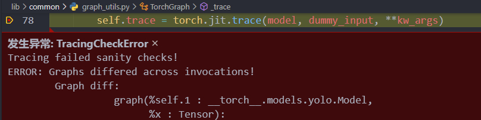
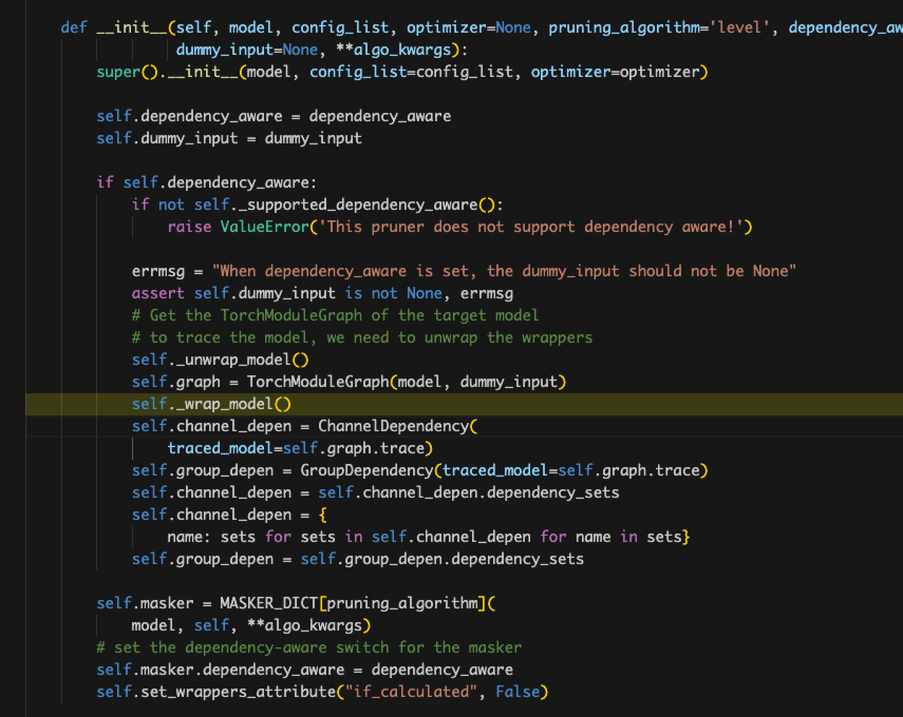
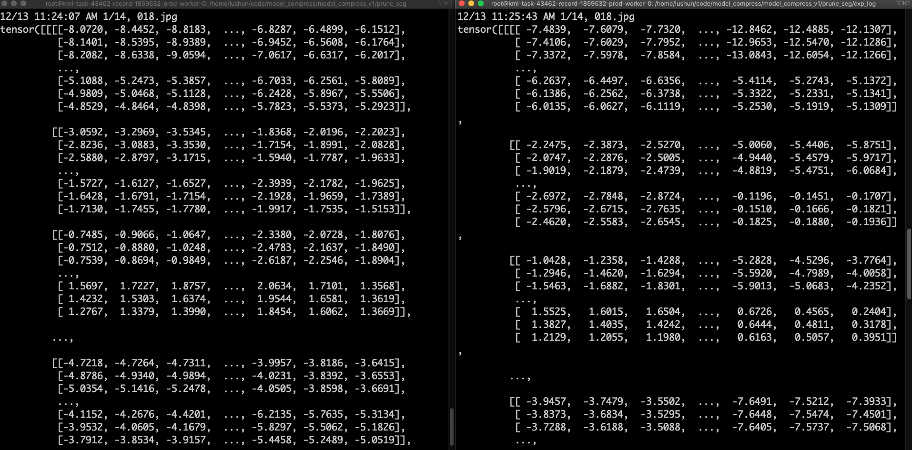
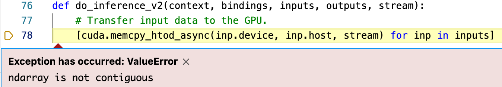

# Bug Summary in English
{: .no_toc }

## Table of contents
{: .no_toc .text-delta }

1. TOC
{:toc}

---

## ResNet50-SSD (Object Detection)

### Pruning

1. When using the FPGM method, torch.jit.trace is unable to trace the model.
* Problem: The model has three outputs as shown below. The third output, self.priors, is a constant and independent of the input, which causes the aforementioned problem.

* Solution: Rewrite an SSD model file, only need to change two points. (1) Move the output self.priors out of the forward function of SSD. (2) Put self.priors into the output during the calculation of loss.
 

2. After exporting the pruned model, an error occurs during inference.
```python
shape '[32, -1, 4]' is invalid for input of size 915904
File "/home/yanglongxing/project/Compress_ResNet50_Detection/prune_model.py", line 172, in forward (Current frame)    
    output = (arm_loc.view(arm_loc.size(0), -1, 4),
File "/home/yanglongxing/anaconda3/envs/py36-torch1.6-trt7/lib/python3.6/site-packages/torch/nn/modules/module.py", line 722, in _call_impl    
    result = self.forward(*input, **kwargs)  
File "/home/yanglongxing/project/Compress_ResNet50_Detection/prune.py", line 135, in eval_net    
    output = net(x)  
File "/home/yanglongxing/project/Compress_ResNet50_Detection/prune.py", line 317, in main    
    eval_net(val_dataset, val_loader, net, detector, cfg, ValTransform, top_k, thresh=thresh, batch_size=batch_size)  
File "/home/yanglongxing/project/Compress_ResNet50_Detection/prune.py", line 324, in <module>    
    main()  
File "/home/yanglongxing/anaconda3/envs/py36-torch1.6-trt7/lib/python3.6/runpy.py", line 85, in _run_code    
    exec(code, run_globals)  
File "/home/yanglongxing/anaconda3/envs/py36-torch1.6-trt7/lib/python3.6/runpy.py", line 96, in _run_module_code    
    mod_name, mod_spec, pkg_name, script_name)  
File "/home/yanglongxing/anaconda3/envs/py36-torch1.6-trt7/lib/python3.6/runpy.py", line 263, in run_path    
    pkg_name=pkg_name, script_name=fname)  
File "/home/yanglongxing/anaconda3/envs/py36-torch1.6-trt7/lib/python3.6/runpy.py", line 85, in _run_code    
    exec(code, run_globals)  
File "/home/yanglongxing/anaconda3/envs/py36-torch1.6-trt7/lib/python3.6/runpy.py", line 193, in _run_module_as_main    
    "__main__", mod_spec)
```
* Problem: The loc and cls outputs of the model are obtained through convolution, and pruning will cut the convolution of these output layers, causing the output size to become smaller, resulting in an error.
* Solution: To solve the issue of inference error after exporting the pruned model, you need to add op_names to only prune the non-output layer convolutions.

3. Slow nms on server

* Problem: nms runs on CPU, but the server has too many programs running, causing high CPU load.
* Solution: Use nms on GPU.

* Note: It is not recommended to use GPU nms, as it may cause code errors during forward, including https://www.cnblogs.com/naive-LR/p/14256624.html and https://blog.csdn.net/m0_38007695/article/details/107065617, and the latter's solution is invalid.

4. The following error occurs during inference before fine-tuning the pruned model:
```python
Traceback (most recent call last):
  File "prune.py", line 409, in <module>
    main()
  File "prune.py", line 378, in main
    eval_net(val_dataset, val_loader, net, detector, cfg, ValTransform, os.path.join(args.save_folder, 'after_prune'), top_k, thresh=thresh, batch_size=batch_size)
  File "prune.py", line 175, in eval_net
    val_dataset.evaluate_detections(all_boxes, eval_save_folder)
  File "/home/yanglongxing/project/Compress_ResNet50_Detection/SSD_Pytorch/data/voc0712.py", line 224, in evaluate_detections
    self._do_python_eval(output_dir)
  File "/home/yanglongxing/project/Compress_ResNet50_Detection/SSD_Pytorch/data/voc0712.py", line 280, in _do_python_eval
    use_07_metric=use_07_metric)
  File "/home/yanglongxing/project/Compress_ResNet50_Detection/SSD_Pytorch/data/voc_eval.py", line 158, in voc_eval
    BB = BB[sorted_ind, :]
IndexError: too many indices for array: array is 1-dimensional, but 2 were indexed
```
* Problem: Poor precision after pruning and before fine-tuning, with empty bounding boxes and an error in the line `BB = BB[sorted_ind, :]` due to the empty list `sorted_ind`. The pruned model is unable to detect objects with poor precision before fine-tuning, causing empty bounding boxes and the error.
* Solution: Modify two lines in "SSD_Pytorch/data/voc_eval.py" (around line 143 and 193) as shown in the following images:
 

5. Difficult to restore precision after model pruning.
* Problem: Before fine-tuning, the optimizer used is the one from before pruning, which optimizes parameters from before pruning instead of the exported pruned model parameters, leading to limited performance improvement during fine-tuning.
* Solution: Redefine the optimizer before fine-tuning as shown below:


### Quantization

1. The inference function in ModelSpeedupTensorRT in the lib package only supports single output, while the detection model has two outputs.
* Solution: Create a new file called quan_model.py and rewrite the SSD model by adding an inference function that calls the quantized trt model to get the dual output results. The modification is as follows:
* Add a load_engine function to the SSD model

* Add the inference(self, x) function to the SSD model. Note: since it needs to convert torch to ONNX, it needs to reference the design of model pruning problem 1.
```python
def inference(self, x):
        """
        Do inference by tensorrt builded engine.

        Parameters
        ----------
        x : pytorch tensor
            Model input tensor
        """
        # convert pytorch tensor to numpy darray
        self.batchssize = 1
        if x.device != torch.device("cpu"):
            x = x.to("cpu")
        x = np.ascontiguousarray(x.numpy())
        # Numpy dtype should be float32
        assert x.dtype == np.float32
        elapsed_time = 0
        inputs, outputs, bindings, stream = common.allocate_buffers(self.engine.context.engine)
        result_cls = []
        result_loc = []
        for start_idx in range(0, x.shape[0], self.batchsize):
            # If the number of images in the test set is not divisible by the batch size, the last batch will be smaller.
            # This logic is used for handling that case.
            end_idx = min(start_idx + self.batchsize, x.shape[0])
            effective_batch_size = end_idx - start_idx
            # Do inference for every batch.
            inputs[0].host = x[start_idx:start_idx + effective_batch_size]
            t1 = time.time()
            outputs = common.do_inference_v2(self.engine.context, bindings=bindings, inputs=inputs, outputs=outputs, stream=stream)
            elapsed_time += time.time() - t1
            shape = outputs[0].shape[0]
            cls = outputs[0][0:int(shape * effective_batch_size / self.batchsize)].reshape(effective_batch_size, 8732, 4)
            result_cls.append(cls.copy())
            shape = outputs[1].shape[0]
            loc = outputs[1][0:int(shape * effective_batch_size / self.batchsize)].reshape(effective_batch_size, 8732, 21)
            result_loc.append(loc.copy())
            # Use argmax to get predictions and then check accuracy
        # convert numpy darray to pytorch tensor
        result_cls = torch.Tensor(np.concatenate(result_cls))
        result_loc = torch.Tensor(np.concatenate(result_loc))
        return result_cls, result_loc, elapsed_time
```
* Load the engine before inference, and call the inference function during inference.
 

2. When compressing the model, the following error is occurred:
```python
TypeError       (note: full exception trace is shown but execution is paused at: <module>)
The element type in the input tensor is not defined.
  File "/home/yanglongxing/anaconda3/envs/py36-torch1.6-trt7/lib/python3.6/site-packages/onnx/numpy_helper.py", line 37, in to_array    raise TypeError("The element type in the input tensor is not defined.")  File "/home/yanglongxing/project/Compress_ResNet50_Detection/lib/compression/pytorch/quantization_speedup/frontend_to_onnx.py", line 82, in unwrapper    index = int(onnx.numpy_helper.to_array(const_nd.attribute[0].t))  File "/home/yanglongxing/project/Compress_ResNet50_Detection/lib/compression/pytorch/quantization_speedup/frontend_to_onnx.py", line 144, in torch_to_onnx    model_onnx, onnx_config = unwrapper(model_onnx, index2name, config)  File "/home/yanglongxing/project/Compress_ResNet50_Detection/lib/compression/pytorch/quantization_speedup/integrated_tensorrt.py", line 303, in compress    _, self.onnx_config = fonnx.torch_to_onnx(self.model, self.config, input_shape=self.input_shape, model_path=self.onnx_path, input_names=self.input_names, output_names=self.output_names)  File "/home/yanglongxing/project/Compress_ResNet50_Detection/quan.py", line 229, in main    engine.compress()  File "/home/yanglongxing/project/Compress_ResNet50_Detection/quan.py", line 241, in <module> (Current frame)    main()  File "/home/yanglongxing/anaconda3/envs/py36-torch1.6-trt7/lib/python3.6/runpy.py", line 85, in _run_code    exec(code, run_globals)  File "/home/yanglongxing/anaconda3/envs/py36-torch1.6-trt7/lib/python3.6/runpy.py", line 96, in _run_module_code    mod_name, mod_spec, pkg_name, script_name)  File "/home/yanglongxing/anaconda3/envs/py36-torch1.6-trt7/lib/python3.6/runpy.py", line 263, in run_path    pkg_name=pkg_name, script_name=fname)  File "/home/yanglongxing/anaconda3/envs/py36-torch1.6-trt7/lib/python3.6/runpy.py", line 85, in _run_code    exec(code, run_globals)  File "/home/yanglongxing/anaconda3/envs/py36-torch1.6-trt7/lib/python3.6/runpy.py", line 193, in _run_module_as_main    "__main__", mod_spec)
```
* Solution: Comment out the `torch.onnx.torch_to_onnx` line and directly export the onnx model using `torch.onnx.export`.


3. The compressed model runs slower than the original model after quantization.
* Problem: The quantization time includes the time to move data from CPU to GPU and from GPU to CPU, which slows down the inference speed.
* Solution: Only calculate the GPU inference time and remove the aforementioned two time blocks. Specifically, add the following function to the SSD class in quan_model.py, and the returned infer_time is the inference time.


## FasterRCNN（Object Detection）

* Due to conflicts between the tcb environment and Starlight, there are conflicts between some of the source code of mmdet1 and Starlight after migrating to a new environment. Therefore, we attempted to use Starlight pruning under the mmdetection2 framework.

### Pruning

1. Error occurs when inputting, requiring additional input of img_meta.
* Problem: The forward() function in mmdetection2 by default calls the forward function in the training stage, which requires additional data information to be input; whereas the pruner only inputs one tensor.
* Solution: Set forward_dummy() to the default way in mmdet/models/detectors/base.py. 


2. After pruning, when loading weights again, the model parameter name does not match the weight file.
* Problem: When the Prunner prunes the model, it encapsulates the model, and the format of the pruned model object is different from that before pruning.
* Solution: **Be sure to initialize a new model instance** before loading weights.

### Quantization
1. Error: from lib.compression.pytorch.utils.counter import count_flops_params.


2. Missing prettytable.
* Solution: Install it using pip.

## VGG-SSD (Object Detection)

### Pruning

1. When using the FPGM method, torch.jit.trace cannot trace the model and reports an error as follows:

* Problem: The model has three outputs as shown below. The third output, self.priors, is a constant that is independent of the input, leading to the above issue. 

* Solution: Rewrite an SSD model file, and make two changes. (1) Move the output self.priors out of the forward function of SSD. (2) Put self.priors into the output during the calculation of loss.

### Quantization

1. Error occurs when exporting the onnx model during quantization.
* Problem:

* Solution: Use torch.onnx.export() directly.

## YOLOv5 (Object Detection)

### Pruning

1. Here, the cat operation should concatenate two tensors, the current layer and a previous layer in the network. The error is because x is just a tensor, so it concatenates itself. 

* Solution：
```python
def forward(self, x): 
    return torch.cat(tuple(x,), self.d)
```

2. Error occurs.


* The specific location of the above error cannot be identified. Later, through step-by-step debugging, it was located at the following if statement during forward propagation. 

* The error is as follows.

* A similar error was found online at https://stackoverflow.com/questions/66746307/torch-jit-trace-tracerwarning-converting-a-tensor-to-a-python-boolean-might-c
* Solution: Do not have uncertain judgment statements such as if or for during forward propagation. Since the if statement was true every time during debugging, the if statement was removed and the statements under the if condition were executed directly. 


3. Error

* Problem: dummy_input is empty. Later, through step-by-step debugging, it was found that model.42.aten::select.291 had no input, as shown in the figure below. 

* In addition, during forward propagation, the following two lines, self.stride and self.anchor_grid, are not defined. This problem did not occur in the original model inference, because the weights loaded in the original model inference contained these two variables, while the jit.trace process after compression could not find these two variables.

* Solution: Add the following lines to assign values to these two variables.


### Quantization

1. After exporting onnx, during the engine generation process, an error occurred: (probably missing the ScatterND plugin)
> [TensorRT] ERROR: INVALID_ARGUMENT: getPluginCreator could not find plugin ScatterND version 1
> ERROR: Fail to parse the ONNX file.
> In node -1 (importFallbackPluginImporter): UNSUPPORTED_NODE: Assertion failed: creator && "Plugin not found, are the plugin name, version, and namespace correct?"
* Solution: https://blog.csdn.net/HW140701/article/details/120377483
  * Successfully compiled the ScatterND.so file. Then, add two lines of code in the following file using the ModelSpeedupTensorRT method to specify the path of the plugin.so file.
  
  * Also, when loading the quantized model with engine.load_quantized_model(trt_path), specify the plugin.so file.
  


## PMR-CNN（Few-shot Object Detection）

### Pruning

1. Input format issue.
* Problem: PMR-CNN is designed based on the detectron2 framework, which requires inputs in dictionary format, while the input format required by the pruner is tensor.
* Solution: Enter the inference module and write other key values in the dictionary as fixed values. Use the 'image' part as dummy_input and only input tensor.


2. In PyTorch 1.6, tensors and ints cannot be directly divided using '/'.
* Solution: Use '//' instead of '/'.


3. Calculation graph error. The program ends automatically after the model finishes the forward propagation and returns the result.
* Problem: The output format is a special format of detectron2, which cannot be recognized by graph_utils.
* Solution: Use backbone instead of model for pruning, and only prune the backbone part.


4. Wrapper.name does not match.
* Problem: curnode.op_type == 'aten::_convolution', this judgment is not made, resulting in empty parent_layers, which in turn affects channel_depen.
* Solution: detectron2 has made additional encapsulation on model layer names, which cannot be recognized and classified by NNI.




5. The value of self.channel_depen.dependency_sets is always empty.
* Problem: Locate the place where dependency_sets is assigned and find that name_to_node in graph_utils.py does not match, and the layer names of the detectron2 encapsulated model cannot be recognized and classified by NNI even if the pth file is modified.


## PSPNet (Semantic Segmentation)

### Pruning

1. For the down-sampling layer, the residual has convolutional layers, and the channel addition between the pruned residual and the pruned main branch does not correspond.

* Solution: Set the output channels of the residual convolutional layer to be the same as the pruned index of the last convolutional layer in the block.

1. During fine-tuning, the model testing time is too long.

* Solution: Use only 10 images for model testing and determine the stopping point.

### Quantization

1. When exporting the model, RuntimeError: ONNX export failed: Couldn't export operator aten::upsample_bilinear2d.

* Solution: Add a parameter "opset_version=11" at the end of the torch.onnx.export() parameter list.

## DeepLabV3 (Semantic Segmentation)

### Pruning

1. Pruning the output layer of the network causes inconsistent output categories for semantic segmentation tasks.

* Problem: Using the automatically generated method can easily lead to this problem, which cannot be automatically handled.
* Solution: Use manual pruning.

2. The channel cannot be aligned for the first downsampling layer of the residual block.

* Problem: The structure order in the in_place_dict is written incorrectly.
* Solution: Correct the input of the first downsampling layer of each residual block to be the residual branch's x, rather than the convolutional branch's x.

3. The channels cannot be aligned for the ASPP module.

* Problem: The pyramid structure consists of 5 parallel branches, each of which takes the external input of the entire pyramid. Due to the incorrect definition of the internal connections in the in_place_dict, an error is reported.
* Solution: Correct the input of the 5 branches to be the same external input x.


## EfficientNet-B3 (Semantic Segmentation)

### Pruning

1. Cannot directly divide Tensor and int values.

* Solution: This problem may be caused by inconsistent treatment of division in different versions of Pytorch. Therefore, converting all Tensors to values can solve this problem.
```python
      input_size = []
      for _size in input_size_ori:
          if torch.is_tensor(_size):
              input_size.append(_size.item())
          else:
              input_size.append(_size)
```

2. Using NNI to automatically construct pruning graph error:

* Solution: Debugging found that the reason is that the custom module "MemoryEfficientSwish" cannot be recognized. This module is an activation function and can be skipped directly. Therefore, modifying the `_pytorch_graph.py` file in the `tensorboard` folder to skip this function can solve the problem.
```python
     class NodePyOP(NodePy):
         def __init__(self, node_cpp):
             super(NodePyOP, self).__init__(node_cpp, methods_OP)
             # Replace single quote which causes strange behavior in TensorBoard
             # TODO: See if we can remove this in the future
             try:
                 self.attributes = str({k: node_cpp[k] for k in node_cpp.attributeNames()}).replace("'", ' ')
                 self.kind = node_cpp.kind()
             except:
                 # raise ValueError('error')
                 self.attributes = []
                 self.kind = node_cpp.kind()
```

3. Code stuck in an infinite loop in _get_parent_layers().
* Problem: The _get_parent_layers() function in ChannelDependency() of lib/compression/pytorch/utils/shape_dependency.py.
* Solution: Avoid traversing nodes that have already been traversed. Add a travel_list, and do not traverse nodes that have already been traversed.
   

4. Unable to recognize the custom module Conv2dStaticSamePadding().

* Problem: Unable to recognize the custom convolutional layer Conv2dStaticSamePadding(), resulting in missing inputs for subsequent layers.
* Solution: Test the following two solutions, and adopt the second one after testing:
  - Add the unrecognized operation function in lib/compression/pytorch/speedup/jit_translate.py. However, for the convolution function F.conv2d(), many parameters need to be input, but the parameters are not passed when recognized. Therefore, this solution is not recommended;
  - Modify the Conv2dStaticSamePadding() module that cannot be recognized to a recognizable form. That is, the original Conv2dStaticSamePadding() inherited nn.Conv2d, and changing it to nn.Module would work. Then, check the places that need to be modified in the definition. This solution is recommended.
  - Code comparison between the original code and the modified code using solution 2 is shown below:
    - Original code, unable to recognize the following modules during pruning:
        ```python
           class Conv2dStaticSamePadding(nn.Conv2d):
               """2D Convolutions like TensorFlow's 'SAME' mode, with the given input image size.
                  The padding mudule is calculated in construction function, then used in forward.
               """
               # With the same calculation as Conv2dDynamicSamePadding
               def __init__(self, in_channels, out_channels, kernel_size, stride=1, image_size=None, **kwargs):
                   super().__init__(in_channels, out_channels, kernel_size, stride, **kwargs)
                   self.stride = self.stride if len(self.stride) == 2 else [self.stride[0]] * 2
                   # Calculate padding based on image size and save it
                   assert image_size is not None
                   ih, iw = (image_size, image_size) if isinstance(image_size, int) else image_size
                   kh, kw = self.weight.size()[-2:]
                   sh, sw = self.stride
                   oh, ow = math.ceil(ih / sh), math.ceil(iw / sw)
                   pad_h = max((oh - 1) * self.stride[0] + (kh - 1) * self.dilation[0] + 1 - ih, 0)
                   pad_w = max((ow - 1) * self.stride[1] + (kw - 1) * self.dilation[1] + 1 - iw, 0)
                   if pad_h > 0 or pad_w > 0:
                       self.static_padding = nn.ZeroPad2d((pad_w - pad_w // 2, pad_w - pad_w // 2,
                                                           pad_h - pad_h // 2, pad_h - pad_h // 2))
                   else:
                       self.static_padding = nn.Identity()
               def forward(self, x):
                   x = self.static_padding(x)
                   x = F.conv2d(x, self.weight, self.bias, self.stride, self.padding, self.dilation, self.groups)
                   return x
           ```
     * Updated code, able to recognize the following modules during pruning:
        ```python
           class Conv2dStaticSamePadding(nn.Module):
               """2D Convolutions like TensorFlow's 'SAME' mode, with the given input image size.
                  The padding mudule is calculated in construction function, then used in forward.
               """
               # With the same calculation as Conv2dDynamicSamePadding
               def __init__(self, in_channels, out_channels, kernel_size, stride=1, image_size=None, **kwargs):
                   super().__init__()
                   self.conv = nn.Conv2d(in_channels, out_channels, kernel_size, stride=stride)
                   self.stride = self.conv.stride if len(self.conv.stride) == 2 else [self.conv.stride[0]] * 2
                   # Calculate padding based on image size and save it
                   assert image_size is not None
                   ih, iw = (image_size, image_size) if isinstance(image_size, int) else image_size
                   kh, kw = self.conv.weight.size()[-2:]
                   sh, sw = self.stride
                   oh, ow = math.ceil(ih / sh), math.ceil(iw / sw)
                   pad_h = max((oh - 1) * self.stride[0] + (kh - 1) * self.conv.dilation[0] + 1 - ih, 0)
                   pad_w = max((ow - 1) * self.stride[1] + (kw - 1) * self.conv.dilation[1] + 1 - iw, 0)
                   if pad_h > 0 or pad_w > 0:
                       self.static_padding = nn.ZeroPad2d((pad_w - pad_w // 2, pad_w - pad_w // 2,
                                                           pad_h - pad_h // 2, pad_h - pad_h // 2))
                   else:
                       self.static_padding = nn.Identity()
               def forward(self, x):
                   x = self.static_padding(x)
                   x = self.conv(x)
                   return x
           ```

5. Out of memory error.
* Problem:"out of memory" error when using ModelSpeedup() due to the default value of confidence parameter (8) which results in a batch size of 8 during automatic model export.
* Solution: Lower the confidence parameter to 2 to reduce the batch size and avoid the "out of memory" error.


### Quantization

1. F.interpolate exported as ONNX results in parsing errors. During export, opset_version=11 was used, and below are the error messages for different definition methods：
* x = F.interpolate(x, size=(int(math.ceil(input_size[-2] / 4)), int(math.ceil(input_size[-1] / 4))), mode='bilinear', align_corners=True)

* x = F.interpolate(x, size=(int(math.ceil(input_size[-2] / 4)), int(math.ceil(input_size[-1] / 4))), mode='bilinear', align_corners=False)

* x = F.interpolate(x, scale_factor=8.0, mode='bilinear', align_corners=False)

* x = F.interpolate(x, scale_factor=8.0, mode='bilinear', align_corners=True)

* x = F.interpolate(x, scale_factor=(8.0, 8.0), mode='bilinear', align_corners=False)


2. pycuda._driver.LogicError: cuMemcpyHtoDAsync failed: invalid argument
* Problem: This error was caused by the inconsistency between the input_shape set in ModelSpeedupTensorRT initialization and the inference time.
```python
   engine = ModelSpeedupTensorRT(
      model,
      input_shape,
      config=None,
      calib_data_loader=calib_loader,
      batchsize=args.batch_size,
      ONNX_path=ONNX_path,
      calibration_cache=cache_path,
      extra_layer_bit=extra_layer_bit,
   )
```
* Solution: Keep the training and inference data dimensions consistent.

3. Check the output of the model before and after quantization - the left image shows the output before quantization, while the right image shows the output after quantization, and there is a significant difference between the two.

* Problem: When decoupling the string in EfficientNet, it will be converted to a list.
* Solution: Remove the square brackets.


## UNet (Drivable Space)

### Pruning

1. Error occurred when exporting pruning code: Given groups=1, weight of size [64, 128, 3, 3], expected input[8, 64, 150, 150] to have 128 channels, but got 64 channels instead.
Cause: In the Up layer of UNet, nn.ConvTranspose2d is followed by Pad and cat operations. NNI cannot parse the combination of nn.ConvTranspose2d + Pad + Cat operations correctly, causing InferMask to parse the output size of Cat as [8, 64, 150, 150], while the correct size should be [8, 128, 150, 150].
* Solution: After analysis, it is found that Pad is an invalid operation because its padding size is 0. Removing the Pad operation enables NNI to parse it correctly.
2. The new model's Pad operation cannot be removed, so a new solution is needed.
Cause: NNI needs to obtain the input of the node when parsing PyTorch nodes. For the *F.pad(x1, (diffX // 2, diffX - diffX // 2, diffY // 2, diffY - diffY // 2)) operation, the second item of the input (diffX // 2, diffX - diffX // 2, diffY // 2, diffY - diffY // 2) is not a Tensor, aten::, prim::ListUnpack, or prim::TupleUnpack, so it cannot be parsed successfully, resulting in only x1 as the input of the pad node and NNI export failure.
* Solution: Do not provide the second item input in the forward function, but create a new Pad class and initialize the second item in the init.

* Also, add support for this module in lib/compression/pytorch/speedup/compress_modules.py.

* In practice, the training and inference resolutions are different, and the Pad size is also different. Therefore, add the following function to the model and provide the resolution before training or inference.


### Quantization

1. Error occurred when loading the quantized model for inference: [TensorRT] ERROR: ../rtSafe/safeContext.cpp (133) - Cudnn Error in configure: 7 (CUDNN_STATUS_MAPPING_ERROR).
Cause: The net was not put on cuda when initializing ModelSpeedupTensorRT.
* Solution: net = UNet(n_channels=3, n_classes=1, bilinear=False).to(device).


## CFNet (Depth Prediction)

### Pruning

1. Environment installation: ModuleNotFoundError: No module named 'OpenEXR'
* Solution: It is recommended to install this software package using the following steps.
  ```shell
     apt-get update
     apt-get install libopenexr-dev
     export CFLAGS="-I/Users/USERNAME/homebrew/include/OpenEXR -std=c++11"
     export LDFLAGS="-L/Users/USERNAME/homebrew/lib"
     pip install OpenEXR
  ```
* Possible issue 1: OpenEXR.cpp:36:10: fatal error: 'ImathBox.h' file not found
* Solution: apt-get install libopenexr-dev
* Reference: https://github.com/AcademySoftwareFoundation/openexr/issues/449
* Possible issue 2: fatal error: 'ImathBox.h' file not found
* Solution: Set the std for compiling in the following way.
* Reference: https://github.com/google-research/kubric/issues/19
```shell
    export CFLAGS="-I/Users/USERNAME/homebrew/include/OpenEXR -std=c++11"
    export LDFLAGS="-L/Users/USERNAME/homebrew/lib"
    pip install OpenEXR
```

2. Two-input problem
* Problem: The network contains two inputs.
* Solution: Set the input parameter dummy_input of the Pruner, such as FPGMPruner, to a tuple (rand_inputs1, rand_inputs2).

3. Check view dimension inconsistency error
* Problem: There is only one dimension in the input of a node.
* Solution: Add a dimension number check.


4. Error of Update_mask() function due to inconsistent dimensions.

* Solution: When constructing the graph, NNI misjudged the predecessors and successors of two convolutions. Obtain the names of these two convolutions in the network in advance and skip pruning algorithms for these two convolutions during pruning.

5. Model size is too large, and a single card cannot handle it during pruning.
* Solution: During debugging of pruning, use a very small input size first; after confirming that pruning can proceed normally, set the BatchSize to the minimum value for pruning.

6. After pruning the model, the subsequent 3D convolutions were not pruned, causing the output of the last layer of the pruned part of the model to be inconsistent with the input of the subsequent unpruned part. 

* Solution: Do not prune any output channels of the last convolution in the pruned part.

### Quantization

1. Node identification failed, and the ONNX model generated at this time cannot be opened with Netron. 
   
* Solution: The problem is caused by the use of tensor slicing in forward propagation. Therefore, there are two solutions: Solution 1: Remove the slicing operation in forward propagation; Solution 2: Add the slicing operation plugin.
* Solution: 1 Test:
  - Since in the forward propagation, the model repeats the same module twice, so in pruning, the two calls are combined and the result is sliced. Since this slicing operation has a problem during quantization, here the forward propagation is adjusted back to the original mode for testing, that is, two repeated calls without slicing.
  - Result: It was found that the same problem occurred, it seems that this problem cannot be bypassed. Because there are a lot of slicing operations in other functions in the network. 
     
     
  * Solution 2 Test:
    - Add a plugin that recognizes the above operations and generate, please refer to "YOLOv5-Quantization Issue Log" for details.

2. ONNX cannot be opened:
* Problem: The problem lies in the fact that the network structure is too large and too complicated.
* Solution: Extract the problematic part of the network separately as a new network, and it can be opened in ONNX.

3. Quantization error of 3D deconvolution。

* Problem: According to the error prompt, it was found that TensorRT does not yet support asymmetric deconvolution. The official reply will support it in the future.

* Solution: The above problem is mainly caused by output_padding=1 in 3D deconvolution, so after setting it to 0, manually pad the output result with 0, and modify the forward propagation code as follows:
```python
# code with bugs
# conv5 = F.relu(self.conv5(conv4) + self.redir2(conv2), inplace=True)
# conv6 = F.relu(self.conv6(conv5) + self.redir1(x), inplace=True)
# code without bugs
y = self.conv5(conv4)
y_pad = torch.zeros_like(y)
y = torch.cat((y, y_pad[:, :, 0, :, :].unsqueeze(dim=2)), dim=2)
y_pad = torch.zeros_like(y)
y = torch.cat((y, y_pad[:, :, :, 0, :].unsqueeze(dim=3)), dim=3)
y_pad = torch.zeros_like(y)
y = torch.cat((y, y_pad[:, :, :, :, 0].unsqueeze(dim=4)), dim=4)
y = self.conv5bn(y)
conv5 = FMish(y + self.redir2(conv2))
y = self.conv6(conv5)
y_pad = torch.zeros_like(y)
y = torch.cat((y, y_pad[:, :, 0, :, :].unsqueeze(dim=2)), dim=2)
y_pad = torch.zeros_like(y)
y = torch.cat((y, y_pad[:, :, :, 0, :].unsqueeze(dim=3)), dim=3)
y_pad = torch.zeros_like(y)
y = torch.cat((y, y_pad[:, :, :, :, 0].unsqueeze(dim=4)), dim=4)
y = self.conv6bn(y)
conv6 = FMish(y + self.redir1(x))
```

4. Quantization export error when dealing with the IF structure in ONNX

* Problem: After visualizing a problematic segment of the model structure that was quantized individually, it was found that the issue was caused by the `torch.squeeze(x,dim=1)` operation. During quantization, it is necessary to check whether the first dimension is 0, and if so, remove this dimension.

* Solution: During forward propagation, it is clear that the first dimension is 0, so no checking is needed. We can use normal indexing directly. The modified code is as follows:
```python
pred2_s4 = F.upsample(pred2_s4 * 8, [left.size()[2], left.size()[3]], mode='bilinear', align_corners=True)
# pred2_s4 = torch.squeeze(pred2_s4, 1) # 报错代码
pred2_s4 = pred2_s4[:, 0, :, :] # 正确代码
pred1_s3_up = F.upsample(pred1_s3 * 4, [left.size()[2], left.size()[3]], mode='bilinear', align_corners=True)
# pred1_s3_up = torch.squeeze(pred1_s3_up, 1) 
pred1_s3_up = pred1_s3_up[:, 0, :, :]
pred1_s2 = F.upsample(pred1_s2 * 2, [left.size()[2], left.size()[3]], mode='bilinear', align_corners=True)
# pred1_s2 = torch.squeeze(pred1_s2, 1)
pred1_s2 = pred1_s2[:, 0, :, :]
```

5. Error occurred when processing Clip structure in ONNX during quantization export.
* Problem: Assertion failed: inputs.at(2).is_weights() && "Clip max value must be an initializer!"
* Solution: After investigation, it was found that this problem was caused by the lack of setting the max parameter in the torch.clamp function. Adding a max parameter in all torch.clamp positions can solve this problem.

6. Error occurred when processing torch.gather structure in ONNX during quantization export.
- Error occurred during quantization code export as shown below:

* The above error does not provide clear information. Therefore, trt_infer.py code was used for debugging, and the following error occurred:

* According to the above error, it can be inferred that the error is due to the lack of support for 'GatherElements'. After torch.gather function is exported to ONNX, it will form a GatherElements node. However, our TensorRT version 7.1.3.4 does not support processing this node.

* After investigation, it was found that TensorRT8.0 supports the GatherElements operation in the form of built-in functions instead of plugins. However, the built-in functions are closed source and cannot be directly referred to. 
* Solution: To work around the above problem, the model is divided into two parts. The first half is quantized, and the second half uses the original model directly. During testing, the output of the first half is converted to Tensor and directly fed into the second half. Alternatively, a quantizable operation can be used to replace the unquantizable operation.


## HSMNet (Location)

### Pruning

1. After pruning, the forward propagation channel of the model cannot be aligned.
* Solution: Based on the error message, check the rounding problem of the convolution layer whose channels cannot be aligned.

### Quantization

1. IF judgment cannot be recognized due to torch.squeeze 

* Problem: When using torch.squeeze to compress dimensions, it is necessary to check whether the dimension is 1. If the check is successful, an IF node will be introduced in the ONNX model, causing TensorRT conversion to fail.
* Solution: Use slicing function instead of using the squeeze function, as shown in the code below.
```python
      # code with error
      # return fvl, costl.squeeze(1)
      # code without error
      return fvl, costl[:, 0, :, :, :]
      # same problem with the above
      # return pred3, torch.squeeze(entropy)
      return pred3, entropy[0, :, :]
```

2. Loading pre-trained weights fails to achieve pre-training performance.

* Problem: The original model was trained on multiple GPUs, and the operation names in the pre-trained weights contain the prefix 'module.', resulting in the failure to load most operations. Since there are slight differences between the operations in the pre-trained weights and the model definition, when loading the weights, the matching is set to strict=False, which did not detect the above problem and eventually led to low accuracy during testing.
* Solution: Remove the 'module.' prefix from the operation names in the pre-trained weights.

3. Inconsistent input sizes in the test dataset.

* Solution: This issue indicates that the localization model needs to handle input data with inconsistent sizes, while model quantization requires fixed input sizes. Therefore, this model cannot be quantized.


## PixelNet (Push)

### Pruning

1. The network has two inputs, one is an RGB image, and the other is a depth image.
* Solution: The input of the defined FPGM also needs to be written as a tuple and passed in, as shown below.


### Quantization

1. After quantization, when inferring the model, the following error occurred:

* Solution：

