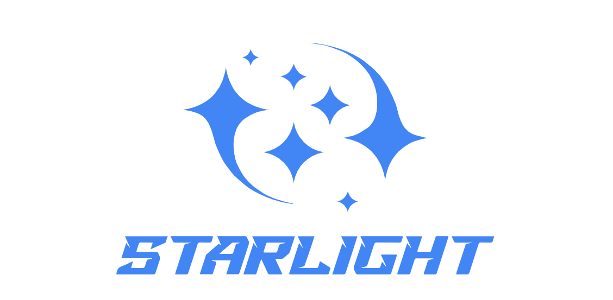

# StarLight: An Open-Source AutoML Toolkit for Lightweighting Deep Neural Networks

<div align=center>

</div>


StarLight helps in obtaining lightweight deep neural networks. StarLight consists primarily of three modules: network compression, neural architecture search, and visualization. The network compression module uses pruning and quantization techniques to convert a pre-trained network into a lightweight structure. The neural architecture search module designs efficient structures by utilizing differentiable architecture search methods. The visualization window can display all of the aforementioned processes, as well as visualizations of network intermediate features.


## Acknowledgments
* This work is supported in part by the National Key R&D Program of China under Grant No. 2018AAA0102701 and in part by the National Natural Science Foundation of China under Grant No. 62176250 and No. 62203424.
* The following people have helped test the StarLight toolkit, read the document and provid valuable feedback: Pengze Wu, Haoyu Li, and Jiancong Zhou.
* Our StarLight framework is built on top of [NNI](https://github.com/microsoft/nni), incorporating their pruning and quantization algorithms. We extend our gratitude to NNI for their remarkable contributions.
* We would like to thank [Just the Docs](https://github.com/just-the-docs/just-the-docs) for providing the template for our documentation. 
* We would like to thank ChatGPT for polishing the presentation of the document.


## Citation
If you find that this project helps your research, you can cite StarLight as following:
```
@misc{StarLight,
  author    = {Shun Lu and Longxing Yang and Zihao Sun and Jilin Mei and Yu Hu,
  year      = {2023},
  address   = {Institute of Computing Technology, Chinese Academy of Sciences},
  title     = {StarLight: An Open-Source AutoML Toolkit for Lightweighting Deep Neural Networks},
  url       = {https://github.com/ICT-ANS/StarLight}
}
```


## Contributing
Thanks for your interest in [StarLight](https://github.com/ICT-ANS/StarLight) and for willing to contribute! We'd love to hear your feedback. 

### Report Bugs
* Please first try to check if an issue exists in our [Bug Summary](https://github.com/ICT-ANS/StarLight) or [Issues](https://github.com/ICT-ANS/StarLight/issues). 
* If not, please describe the bug in detail and we will give a timely reply. 

### Commit New Networks
* We are happy to integrate your network to our StarLight. Please provide your network with the results and hyper-parameters to us. And a detailed description would be better. Thank you!

## License
This project is under the MIT license - please see the [LICENSE](https://github.com/ICT-ANS/StarLight/blob/main/LICENSE) for details.

## Contact us
StarLight is an open-source project developed by the ANS@ICT research team. We welcome and value your feedback and suggestions, so please don't hesitate to contact us via email at ict.ans.automl@outlook.com
<div align=center>

</div>